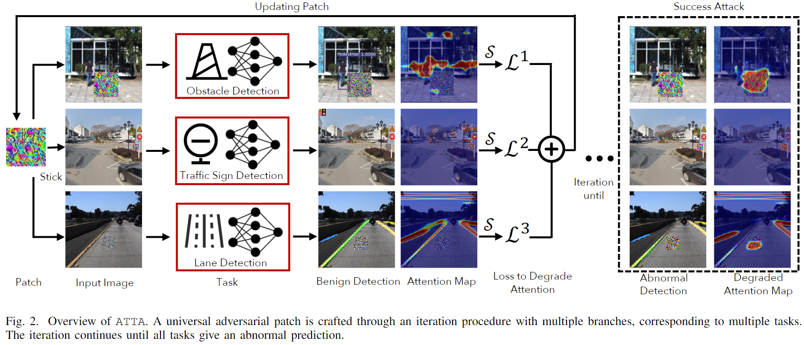

# ATTA: Adversarial Task-transferable Attacks on Autonomous Driving Systems

This is the code for paper *ATTA: Adversarial Task-transferable Attacks on Autonomous Driving Systems*, accepted by IEEE ICDM 2023.

This directory does not contain datasets and DNN models' weights due to their large size.

## Overview of ATTA
> ABSTRACT: Deep learning (DL) based perception models have
enabled the possibility of current autonomous driving systems
(ADS). However, various studies have pointed out that the DL
models inside the ADS perception modules are vulnerable to
adversarial attacks which can easily manipulate these DL models’
predictions. In this paper, we propose a more practical adversarial attack against the ADS perception module. Particularly,
instead of targeting one of the DL models inside the ADS
perception module, we propose to use one universal patch to
mislead multiple DL models inside the ADS perception module
simultaneously which leads to a higher chance of system-wide
malfunction. We achieve such a goal by attacking the attention
of DL models as a higher level of feature representation rather
than traditional gradient-based attacks. We successfully generate
a universal patch containing malicious perturbations that can
attract multiple victim DL models’ attention to further induce
their prediction errors. We verify our attack with extensive
experiments on a typical ADS perception module structure with
five famous datasets and also physical world scenes.



## System requirements
* Experiments done on 8 NVIDIA GeForce RTX 3080Ti GPUs and 10 NVIDIA GeForce RTX 3090 GPUs
* Codes executed with Pytorch 1.x and Python 3.8.0

## Playing with ATTA

```bash
pip install -r requirements.txt
```

### Obstacle Detection
```bash
python ObstacleDetection/AoA_obstacle.py
```

### TrafficSign Detection
```bash
python TrafficSignDetection/AoA_ts.py
```

### RoadLine Detection
```bash
python RoadLineDetection/AoA_rl.py
```
### MultiTask Train
```bash
python MultiTaskTrain/AoA_odtsrl.py
```

